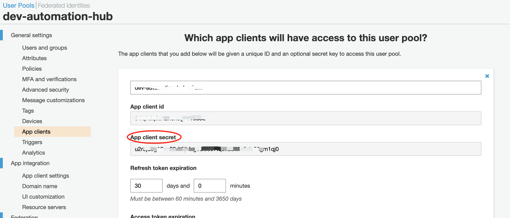

# Documentation of move to overip cognito service
There is a brief instruction about how to move the cognito service to OverIP's cognito service. 

## For Frontend

Under the `/src` folder, there is a `aws-exports.js` file, 

All need to do on the frontend is to change the file to the one below. Notice: the commented code needs to be commented right now, because there is no identity pool created.

```js

const awsmobile = {
  "aws_project_region": "ap-southeast-2",
  // "aws_cognito_identity_pool_id": "ap-southeast-2:07c8bf6e-b1b6-4bfd-ba86-0318ba06d8a9",
  "aws_cognito_region": "ap-southeast-2",
  "aws_user_pools_id": "ap-southeast-2_0Lf79DznX",
  "aws_user_pools_web_client_id": "31iqkdq6a42hehog051o85d5vr",
  "oauth": {
      "domain": "automation-hub-dev1.auth.ap-southeast-2.amazoncognito.com",
      "scope": [
          "phone",
          "email",
          "openid",
          "profile",
          "aws.cognito.signin.user.admin"
      ],
      "redirectSignIn": "http://localhost:3000/signin/",
      "redirectSignOut": "http://localhost:3000/signin/",
      "responseType": "code"
  },
  "federationTarget": "COGNITO_USER_POOLS"
};


export default awsmobile;

```

## For Aws service
Go to the User Pool of `dev-automation-hub`, `App clients`. There is a App client secret having value. However, in the User Pool for `dev-support-hub`, there is no value for App client secret. 

From my research, frontend using `Auth pacakge` to complete the whole process of login/sign-in, it is not supporting the App client secret right now. So need to remove it for the login/sign-in working.


